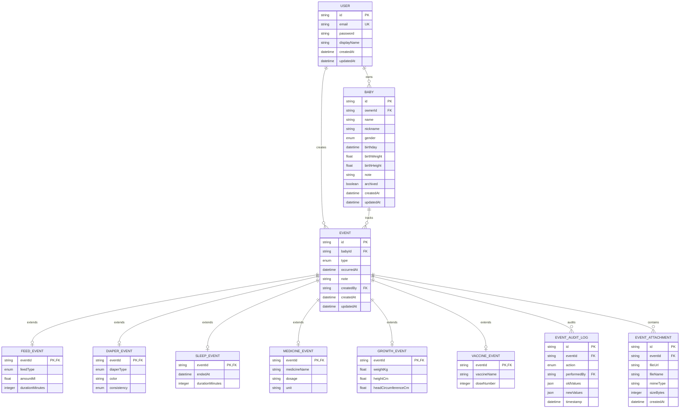
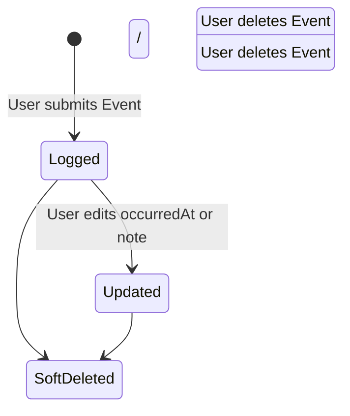

# Event Engine Architecture Specification

This document details the architectural design and structural foundation for the **Event Engine** in the Baby Tracker application, as specified in **Phrase 4**.

---

## 1. Architectural Strategy & Trade-off Analysis

### Core Design Pattern: Extension Tables (Class Table Inheritance)

To model diverse baby activity events (Feed, Diaper, Sleep, Medicine, Growth, Vaccination) while keeping the database schema normalized and query performance predictable, we adopt the **Extension Tables Pattern** (Class Table Inheritance).

#### Comparison of Architectural Approaches

| Approach | Description | Pros | Cons | Decision |
| :--- | :--- | :--- | :--- | :--- |
| **Extension Tables (Class Table Inheritance)** | Core `Event` table holds base attributes (`id`, `babyId`, `type`, `occurredAt`, `note`, `createdBy`). Each event type (e.g., `FeedEvent`, `DiaperEvent`) has a 1:1 extension table referencing `Event.id`. | • No nullable columns in base/extension tables.<br>• Clean relational constraints & foreign keys.<br>• Predictable, type-safe queries.<br>• Highly scalable for adding new event types. | • Requires JOINs when querying full details of a specific event type. | **SELECTED** |
| **Single Giant Table (STI)** | A single `events` table containing every field for all event types. | • Simple queries (no JOINs). | • Numerous nullable columns.<br>• Loss of DB-level NOT NULL constraints for module fields.<br>• Schema clutter as new modules grow. | Rejected |
| **Dynamic JSONB Payload** | Base `Event` table with a `data` `JSONB` column storing type-specific details. | • Highly flexible schema.<br>• Single table queries. | • Lack of DB-level schema validation and foreign key constraints.<br>• Harder indexing & complex analytical SQL queries. | Rejected |
| **Entity-Attribute-Value (EAV)** | Storing payload data as key-value pairs in an `event_attributes` table. | • Generic key-value schema. | • High query latency.<br>• Complex mapping.<br>• Extremely difficult reporting & aggregation. | Rejected |

---

## 2. Database ERD



---

## 3. Domain Model Architecture

In the domain layer, all events inherit from a base `Event` entity. When specialized event types are introduced, domain entities wrap the core `Event` and attach type-safe extension payloads.

```typescript
// Core Base Event Entity
export class Event {
  constructor(
    public readonly id: string,
    public readonly babyId: string,
    public readonly type: EventType,
    public readonly occurredAt: Date,
    public readonly note: string,
    public readonly createdBy: string,
    public readonly createdAt: Date,
    public readonly updatedAt: Date,
  ) {}
}

// Extensible Domain Event Wrapper Interface (For Future Modules)
export interface ExtendedEvent<TExtension> {
  base: Event;
  extension: TExtension;
}
```

---

## 4. Monorepo Folder Structure

```
apps/
  api/
    src/
      events/
        domain/
          entities/
            event.entity.ts
          repositories/
            event.repository.interface.ts
          errors/
            event.errors.ts
        application/
          dtos/
            create-event.dto.ts
            update-event.dto.ts
            list-events-query.dto.ts
          use-cases/
            create-event.use-case.ts
            create-event.use-case.spec.ts
            get-event.use-case.ts
            get-event.use-case.spec.ts
            list-events.use-case.ts
            list-events.use-case.spec.ts
            update-event.use-case.ts
            update-event.use-case.spec.ts
            delete-event.use-case.ts
            delete-event.use-case.spec.ts
        infrastructure/
          repositories/
            prisma-event.repository.ts
        presentation/
          controllers/
            events.controller.ts
        events.module.ts
      # Future Extension Modules (Phrase 5+)
      feed/
        domain/
        application/
        infrastructure/
        presentation/
      diaper/
        domain/
        application/
        infrastructure/
        presentation/
packages/
  shared-types/
    src/
      index.ts
```

---

## 5. REST API Specifications

### Base Endpoint Path: `/api/v1/babies/:babyId/events`

#### 1. Create Event
- **Method**: `POST /api/v1/babies/:babyId/events`
- **Headers**: `Authorization: Bearer <JWT>`
- **Request Body**:
  ```json
  {
    "type": "FEED",
    "occurredAt": "2026-07-27T10:00:00.000Z",
    "note": "Morning feeding session"
  }
  ```
- **Response (201 Created)**:
  ```json
  {
    "id": "c1a2b3c4-...",
    "babyId": "b9f8e7d6-...",
    "type": "FEED",
    "occurredAt": "2026-07-27T10:00:00.000Z",
    "note": "Morning feeding session",
    "createdBy": "u1v2w3x4-...",
    "createdAt": "2026-07-27T10:00:05.000Z",
    "updatedAt": "2026-07-27T10:00:05.000Z"
  }
  ```

#### 2. List Events
- **Method**: `GET /api/v1/babies/:babyId/events?type=FEED&from=2026-07-01T00:00:00Z&to=2026-07-27T23:59:59Z&limit=50`
- **Headers**: `Authorization: Bearer <JWT>`
- **Response (200 OK)**:
  ```json
  [
    {
      "id": "c1a2b3c4-...",
      "babyId": "b9f8e7d6-...",
      "type": "FEED",
      "occurredAt": "2026-07-27T10:00:00.000Z",
      "note": "Morning feeding session",
      "createdBy": "u1v2w3x4-...",
      "createdAt": "2026-07-27T10:00:05.000Z",
      "updatedAt": "2026-07-27T10:00:05.000Z"
    }
  ]
  ```

#### 3. Get Single Event
- **Method**: `GET /api/v1/babies/:babyId/events/:eventId`
- **Response (200 OK)**: Single Event JSON object.

#### 4. Update Event
- **Method**: `PATCH /api/v1/babies/:babyId/events/:eventId`
- **Request Body**:
  ```json
  {
    "occurredAt": "2026-07-27T10:05:00.000Z",
    "note": "Updated note"
  }
  ```
- **Response (200 OK)**: Updated Event JSON object.

#### 5. Delete Event
- **Method**: `DELETE /api/v1/babies/:babyId/events/:eventId`
- **Response (204 No Content)**

---

## 6. Event Lifecycle & Invariants



### Business Invariants
1. **Core Immutability**: `id`, `babyId`, `type`, `createdBy`, and `createdAt` cannot be altered once recorded.
2. **Access Control**: Users can only interact with events belonging to a baby they explicitly own.
3. **Timeline Ordering**: Events default to descending order by `occurredAt`.

---

## 7. Audit & Attachment Strategies

### Audit Strategy (`EventAuditLog`)
- Every mutating action (`CREATE`, `UPDATE`, `DELETE`) writes an entry to `EventAuditLog`.
- Captures `eventId`, `action`, `performedBy`, snapshot of changed data (`oldValues`, `newValues`), and UTC `timestamp`.
- Enables complete revision history and security auditing.

### Attachment Strategy (`EventAttachment`)
- Attachments (e.g. photos of diaper rashes, growth charts, medical prescriptions) store metadata in `EventAttachment`.
- Binary assets are stored in object storage (S3 / GCP Bucket / MinIO) using presigned upload URLs.
- Deleting an event triggers a cascade cleanup of associated `EventAttachment` records and file storage assets.
